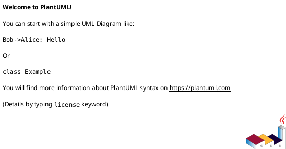
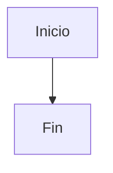

# 📊 Diagramas UML - Sistema de Gestión Editorial FESC

Este directorio contiene todos los diagramas UML del proyecto en dos formatos: **PlantUML** (.puml) y **Mermaid** (.mmd).

## 📁 Contenido

### Diagramas PlantUML (.puml)

Los archivos `.puml` están en la raíz de `/diagrams/`:

1. **01-workflow-editorial.puml** - Diagrama de estados del workflow editorial
2. **02-arquitectura-sistema.puml** - Arquitectura completa del sistema
3. **03-casos-de-uso.puml** - Casos de uso por rol
4. **04-secuencia-envio-articulo.puml** - Secuencia de envío de artículo
5. **05-modelo-datos.puml** - Modelo de datos (entidades)
6. **06-roles-permisos.puml** - Matriz de roles y permisos
7. **07-componentes-react.puml** - Arquitectura de componentes React

### Diagramas Mermaid (.mmd)

Los archivos `.mmd` están en `/diagrams/mermaid/`:

1. **01-workflow-editorial.mmd** - Diagrama de estados del workflow editorial
2. **02-arquitectura-sistema.mmd** - Arquitectura completa del sistema
3. **03-casos-de-uso.mmd** - Casos de uso por rol
4. **04-secuencia-envio-articulo.mmd** - Secuencia de envío de artículo
5. **05-modelo-datos.mmd** - Modelo de datos (entidades)

---

## 🛠️ Cómo Generar Imágenes

### Opción 1: PlantUML Online (Más Fácil)

1. Ve a **http://www.plantuml.com/plantuml/uml/**
2. Copia el contenido de cualquier archivo `.puml`
3. Pégalo en el editor
4. La imagen se genera automáticamente
5. Descarga como PNG, SVG o PDF

**Ejemplo:**
```
http://www.plantuml.com/plantuml/uml/
→ Copiar contenido de 01-workflow-editorial.puml
→ Pegar y visualizar
→ Download → PNG
```

### Opción 2: PlantUML CLI (Local)

#### Instalación:

```bash
# En Ubuntu/Debian
sudo apt-get install plantuml

# En macOS
brew install plantuml

# En Windows
choco install plantuml
```

#### Generar Imágenes:

```bash
# Generar un diagrama específico
plantuml diagrams/01-workflow-editorial.puml

# Generar todos los diagramas
plantuml diagrams/*.puml

# Generar en formato SVG (mejor calidad)
plantuml -tsvg diagrams/*.puml

# Generar en formato PNG
plantuml -tpng diagrams/*.puml

# Generar en formato PDF
plantuml -tpdf diagrams/*.puml
```

Las imágenes se generarán en el mismo directorio con extensión `.png`, `.svg` o `.pdf`.

### Opción 3: VS Code Extension

1. Instalar extensión: **PlantUML** por jebbs
2. Abrir cualquier archivo `.puml`
3. Presionar `Alt + D` para preview
4. Click derecho → Export Current Diagram

### Opción 4: Mermaid Live Editor (Para archivos .mmd)

1. Ve a **https://mermaid.live/**
2. Copia el contenido de cualquier archivo `.mmd`
3. Pégalo en el editor
4. La imagen se renderiza automáticamente
5. Descarga como PNG o SVG

**Ejemplo:**
```
https://mermaid.live/
→ Copiar contenido de mermaid/01-workflow-editorial.mmd
→ Pegar y visualizar
→ Actions → PNG/SVG
```

### Opción 5: Mermaid CLI (Local)

#### Instalación:

```bash
npm install -g @mermaid-js/mermaid-cli
```

#### Generar Imágenes:

```bash
# Generar un diagrama específico
mmdc -i diagrams/mermaid/01-workflow-editorial.mmd -o workflow.png

# Generar todos los diagramas Mermaid
cd diagrams/mermaid
for file in *.mmd; do
  mmdc -i "$file" -o "${file%.mmd}.png"
done

# Generar en SVG
mmdc -i diagrams/mermaid/01-workflow-editorial.mmd -o workflow.svg
```

### Opción 6: GitHub/GitLab (Mermaid)

Los archivos `.mmd` se pueden visualizar directamente en GitHub/GitLab:

1. Crea un archivo `.md` en tu repositorio
2. Agrega el diagrama con sintaxis de code block:

````markdown
```mermaid
[contenido del archivo .mmd aquí]
```
````

GitHub y GitLab renderizarán el diagrama automáticamente.

---

## 📸 Capturas de Pantalla Recomendadas

Para documentación profesional, genera estas imágenes:

### Para README principal:
- `01-workflow-editorial.png` - Mostrar el flujo editorial
- `02-arquitectura-sistema.png` - Overview de la arquitectura
- `06-roles-permisos.png` - Explicar permisos

### Para documentación técnica:
- `05-modelo-datos.png` - Estructura de datos
- `07-componentes-react.png` - Arquitectura frontend

### Para presentaciones:
- `03-casos-de-uso.png` - Funcionalidades por rol
- `04-secuencia-envio-articulo.png` - Flujo de usuario

---

## 🎨 Personalización

### Colores Institucionales FESC

Los diagramas ya usan los colores de FESC:
- **Rojo principal:** `#E30513`
- **Rojo oscuro:** `#9C0F06`
- **Verde (Admin):** `#E8F5E9`
- **Amarillo (Autor):** `#FFF9C4`
- **Naranja (Revisor):** `#FFE0B2`

### Modificar Diagramas

Para editar un diagrama:

1. Abre el archivo `.puml` o `.mmd`
2. Modifica el contenido
3. Regenera la imagen con cualquiera de las opciones anteriores

**Sintaxis PlantUML:**


**Sintaxis Mermaid:**


---

## 🌐 Herramientas Online Recomendadas

### PlantUML:
- **http://www.plantuml.com/plantuml/** - Editor oficial
- **https://plantuml-editor.kkeisuke.com/** - Editor con preview

### Mermaid:
- **https://mermaid.live/** - Editor oficial (recomendado)
- **https://mermaid.ink/** - Generador de imágenes por URL

### Conversores:
- **https://github.com/mermaid-js/mermaid-to-plantuml** - Convertir Mermaid a PlantUML

---

## 📝 Ejemplos de Uso

### Insertar en Documentación Markdown

```markdown
# Mi Documentación

## Arquitectura del Sistema


El sistema está dividido en tres capas principales...
```

### Insertar en LaTeX

```latex
\begin{figure}[h]
  \centering
  \includegraphics[width=0.8\textwidth]{diagrams/01-workflow-editorial.png}
  \caption{Workflow Editorial}
  \label{fig:workflow}
\end{figure}
```

### Insertar en Presentaciones PowerPoint/Google Slides

1. Genera la imagen en formato PNG o SVG
2. Inserta como imagen en tu presentación
3. Ajusta el tamaño según necesites

---

## 🔄 Actualización de Diagramas

Cuando el sistema cambie, actualiza los diagramas siguiendo estos pasos:

1. **Identificar cambios:** ¿Qué componente/flujo cambió?
2. **Editar archivo correspondiente:** Modifica el `.puml` o `.mmd`
3. **Regenerar imagen:** Usa cualquiera de las opciones anteriores
4. **Verificar consistencia:** Revisa que coincida con el código
5. **Commit cambios:** Guarda tanto el fuente como la imagen

---

## 📚 Referencias

### PlantUML:
- **Documentación oficial:** https://plantuml.com/
- **Guía de sintaxis:** https://plantuml.com/guide
- **Ejemplos:** https://real-world-plantuml.com/

### Mermaid:
- **Documentación oficial:** https://mermaid.js.org/
- **Sintaxis:** https://mermaid.js.org/intro/
- **Ejemplos:** https://mermaid.js.org/ecosystem/integrations.html

---

## ❓ Preguntas Frecuentes

### ¿Cuál formato usar: PlantUML o Mermaid?

- **PlantUML:** Más maduro, más opciones de personalización, mejor para diagramas complejos
- **Mermaid:** Más moderno, soportado nativamente en GitHub/GitLab, sintaxis más simple

**Recomendación:** Usa **Mermaid** para documentación en repositorios, **PlantUML** para presentaciones y documentos formales.

### ¿Cómo cambio los colores?

**PlantUML:**
```plantuml
skinparam BackgroundColor #E30513
```

**Mermaid:**


### ¿Puedo generar diagramas desde el código?

Sí, existen herramientas para generar diagramas automáticamente:
- **tplant** - TypeScript/JavaScript a PlantUML
- **ts-uml** - TypeScript a UML
- **code2flow** - Código a diagramas de flujo

---

## 📊 Tipos de Diagramas Disponibles

| Diagrama | Tipo UML | Formato | Descripción |
|----------|----------|---------|-------------|
| 01-workflow-editorial | State | PlantUML, Mermaid | Estados del artículo |
| 02-arquitectura-sistema | Component | PlantUML, Mermaid | Arquitectura completa |
| 03-casos-de-uso | Use Case | PlantUML, Mermaid | Funcionalidades por rol |
| 04-secuencia-envio | Sequence | PlantUML, Mermaid | Flujo de envío |
| 05-modelo-datos | Class | PlantUML, Mermaid | Entidades y relaciones |
| 06-roles-permisos | Component | PlantUML | Permisos por rol |
| 07-componentes-react | Component | PlantUML | Arquitectura React |

---

## ✅ Checklist de Generación

Antes de entregar documentación con diagramas:

- [ ] Todos los diagramas generados en PNG (alta resolución)
- [ ] SVG generados para escalabilidad
- [ ] Verificar que reflejan el estado actual del código
- [ ] Nombres de archivos descriptivos
- [ ] Colores institucionales aplicados
- [ ] Leyendas y notas incluidas
- [ ] Sin errores de sintaxis en PlantUML/Mermaid

---

**© 2026 FESC - Diagramas del Sistema de Gestión Editorial**

¡Listo para generar tus imágenes! 🎨📊
