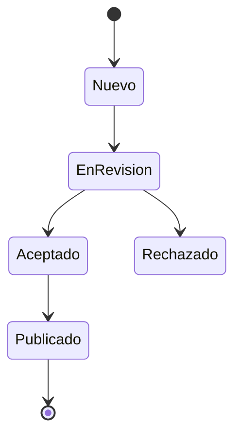

# 📖 Ejemplos de Uso de Diagramas UML

Guía práctica de cómo usar los diagramas en diferentes formatos de documentación.

---

## 🌐 1. GitHub / GitLab (Markdown con Mermaid)

### Opción A: Renderizado Directo

GitHub y GitLab renderizan automáticamente diagramas Mermaid:

```markdown
# Mi Documentación

## Workflow Editorial


```

### Opción B: Imagen Generada

```markdown
## Arquitectura del Sistema


El sistema está compuesto por...
```

---

## 📄 2. Microsoft Word / Google Docs

### Pasos:

1. **Generar imagen PNG:**
   ```bash
   cd diagrams
   ./generate-all.sh  # Linux/Mac
   # o
   generate-all.bat   # Windows
   ```

2. **Insertar en Word:**
   - Insertar → Imagen → Desde archivo
   - Seleccionar `diagrams/output/png/01-workflow-editorial.png`
   - Ajustar tamaño (recomendado: ancho de página)

3. **Agregar pie de imagen:**
   - Click derecho en imagen → Insertar título
   - "Figura 1: Workflow Editorial del Sistema"

### Ejemplo de Párrafo:

```
El sistema implementa un workflow editorial completo (ver Figura 1) 
que guía el artículo desde su envío inicial hasta la publicación final. 
El proceso incluye etapas de revisión por pares y permite iteraciones 
cuando se requieren correcciones.

[Figura 1 aquí]

Figura 1: Workflow Editorial del Sistema de Gestión FESC
```

---

## 📊 3. PowerPoint / Google Slides

### Para Presentaciones Profesionales:

1. **Generar SVG (mejor calidad):**
   ```bash
   plantuml -tsvg diagrams/01-workflow-editorial.puml
   ```

2. **Insertar en PowerPoint:**
   - Insertar → Imágenes → Este dispositivo
   - Seleccionar archivo SVG o PNG
   - Redimensionar manteniendo aspecto

### Layout Recomendado:

```
┌─────────────────────────────────────┐
│ Título: Workflow Editorial          │
├─────────────────────────────────────┤
│                                     │
│    [Diagrama aquí - 70% ancho]     │
│                                     │
│    • Punto clave 1                 │
│    • Punto clave 2                 │
│    • Punto clave 3                 │
└─────────────────────────────────────┘
```

### Diapositiva de Ejemplo:

**Título:** "Flujo de Revisión de Artículos"

**Contenido:**
- Imagen: `01-workflow-editorial.png`
- Bullets:
  - 6 estados principales en el proceso
  - Revisión por pares obligatoria
  - Posibilidad de iteraciones

---

## 📝 4. LaTeX / Overleaf

### Preámbulo:

```latex
\usepackage{graphicx}
\graphicspath{{diagrams/output/png/}}
```

### Insertar Figura:

```latex
\begin{figure}[h]
  \centering
  \includegraphics[width=0.9\textwidth]{01-workflow-editorial.png}
  \caption{Workflow Editorial del Sistema FESC}
  \label{fig:workflow}
\end{figure}

Como se observa en la Figura~\ref{fig:workflow}, el sistema 
implementa un proceso editorial completo...
```

### Con Subfiguras:

```latex
\usepackage{subcaption}

\begin{figure}[h]
  \centering
  \begin{subfigure}[b]{0.48\textwidth}
    \includegraphics[width=\textwidth]{01-workflow-editorial.png}
    \caption{Workflow Editorial}
  \end{subfigure}
  \hfill
  \begin{subfigure}[b]{0.48\textwidth}
    \includegraphics[width=\textwidth]{02-arquitectura-sistema.png}
    \caption{Arquitectura del Sistema}
  \end{subfigure}
  \caption{Diagramas principales del sistema}
  \label{fig:main-diagrams}
\end{figure}
```

---

## 🌍 5. Sitio Web / HTML

### Opción A: Imagen Estática

```html
<figure>
  
  <figcaption>Figura 2: Arquitectura del Sistema FESC</figcaption>
</figure>
```

### Opción B: Mermaid.js (Renderizado Cliente)

```html
<!DOCTYPE html>
<html>
<head>
  <script type="module">
    import mermaid from 'https://cdn.jsdelivr.net/npm/mermaid@10/dist/mermaid.esm.min.mjs';
    mermaid.initialize({ startOnLoad: true });
  </script>
</head>
<body>
  <div class="mermaid">
    stateDiagram-v2
      [*] --> Nuevo
      Nuevo --> EnRevision
      EnRevision --> Aceptado
  </div>
</body>
</html>
```

---

## 📑 6. Notion

### Pasos:

1. Generar imagen PNG
2. Abrir Notion
3. Escribir `/image`
4. Seleccionar "Upload"
5. Subir imagen desde `diagrams/output/png/`
6. Agregar caption: "Figura X: [Descripción]"

### Alternativa - Embed con Mermaid Live:

1. Ir a https://mermaid.live/
2. Pegar código del `.mmd`
3. Copiar URL compartible
4. En Notion: `/embed` → Pegar URL

---

## 📧 7. Emails / Newsletters

### HTML Email:

```html
<table width="600" align="center">
  <tr>
    <td>
      <h2>Nuevo Sistema de Gestión Editorial</h2>
      <p>Nos complace presentar el workflow editorial:</p>
      
      <p style="font-size: 12px; color: #666;">
        Figura 1: Proceso editorial completo
      </p>
    </td>
  </tr>
</table>
```

---

## 📱 8. Documentación Móvil (README móvil)

### Para que se vea bien en móviles:

```markdown
## Workflow

<div align="center">
  
  <p><em>Figura 1: Proceso editorial</em></p>
</div>
```

---

## 🎓 9. Tesis / Trabajos Académicos

### Formato APA:

```
Figura 1

Workflow Editorial del Sistema de Gestión FESC

[Imagen aquí]

Nota. Diagrama de estados que muestra el ciclo completo de 
revisión de un artículo científico, desde su envío hasta 
la publicación. Desarrollado para Revista Mundo FESC (2026).
```

### Cita en Texto:

```
El sistema implementa un proceso editorial completo que 
incluye revisión por pares (ver Figura 1). Este proceso 
garantiza la calidad de los artículos publicados...
```

---

## 📊 10. Dashboard / Confluence

### Confluence:

1. Editar página
2. Click en "+"
3. Seleccionar "Imagen"
4. Subir desde `diagrams/output/png/`
5. Ajustar tamaño
6. Agregar texto alternativo

### Código Macro (Confluence):

```
{mermaid}
stateDiagram-v2
  [*] --> Nuevo
  Nuevo --> EnRevision
{mermaid}
```

---

## 🎨 11. Figma / Design Tools

### Importar a Figma:

1. Generar SVG:
   ```bash
   plantuml -tsvg diagrams/02-arquitectura-sistema.puml
   ```

2. En Figma:
   - File → Place Image
   - Seleccionar SVG
   - La imagen se puede editar como vectores

---

## 📦 12. Documentación de API (Swagger/OpenAPI)

### En Markdown de Swagger:

```yaml
info:
  description: |
    # Sistema de Gestión Editorial FESC
    
    ## Arquitectura
    
    
    
    El sistema está dividido en tres capas principales...
```

---

## 💡 Tips Generales

### 1. Resolución Recomendada

- **Presentaciones:** PNG 300 DPI (usar `-DPLANTUML_LIMIT_SIZE=16384`)
- **Web:** SVG (escalable, menor tamaño)
- **Impresión:** SVG o PNG de alta resolución
- **Email:** PNG optimizado (comprimir con TinyPNG)

### 2. Nombrado de Archivos

```
✅ Bueno: 01-workflow-editorial.png
❌ Malo:  diagrama1.png
❌ Malo:  Workflow Editorial (con espacios).png
```

### 3. Tamaños Recomendados

| Medio | Ancho Recomendado |
|-------|-------------------|
| PowerPoint | 1280px - 1920px |
| Word | 600px - 800px |
| Web | SVG o 100% width |
| Email | 550px - 600px |
| Móvil | 100% width, max 600px |

### 4. Compresión

```bash
# Optimizar PNGs (instalar optipng)
optipng -o7 diagrams/output/png/*.png

# Optimizar con ImageMagick
mogrify -resize 1200x -quality 85 diagrams/output/png/*.png
```

---

## 🔗 URLs para Diagramas Dinámicos

### PlantUML Server:

```
http://www.plantuml.com/plantuml/png/[encoded_diagram]
```

Ejemplo de uso en Markdown:
```markdown

```

### Mermaid.ink:

```
https://mermaid.ink/img/[base64_encoded_diagram]
```

Ejemplo:
```markdown

```

---

## ✅ Checklist de Calidad

Antes de usar un diagrama:

- [ ] Imagen generada en resolución adecuada
- [ ] Texto legible (probar zoom out)
- [ ] Colores institucionales presentes
- [ ] Leyenda incluida si es necesaria
- [ ] Pie de figura descriptivo
- [ ] Referencia en el texto principal
- [ ] Formato correcto para el medio (PNG/SVG)
- [ ] Tamaño de archivo optimizado

---

## 📚 Plantillas Listas para Usar

### Plantilla README.md:

```markdown
# Mi Proyecto

## Arquitectura


*Figura 1: Arquitectura de tres capas del sistema FESC*

El sistema se compone de:
- **Frontend:** React + TypeScript
- **Services:** StorageService, i18nService  
- **Data:** localStorage (migrar a PostgreSQL en v2.0)
```

### Plantilla LaTeX (Thesis):

```latex
\section{Diseño del Sistema}

\subsection{Workflow Editorial}

El sistema implementa un workflow editorial completo 
basado en las mejores prácticas de Open Journal Systems.

\begin{figure}[H]
  \centering
  \includegraphics[width=0.85\textwidth]{diagrams/output/png/01-workflow-editorial.png}
  \caption{Diagrama de estados del workflow editorial}
  \label{fig:workflow}
\end{figure}

Como se observa en la Figura~\ref{fig:workflow}, 
el proceso incluye 6 estados principales...
```

---

**© 2026 FESC - Guía de Uso de Diagramas UML**
